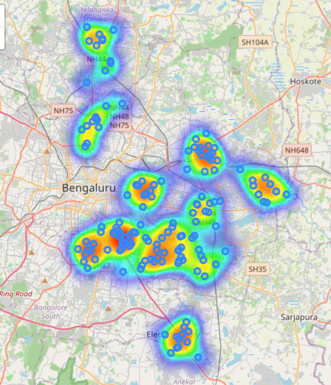
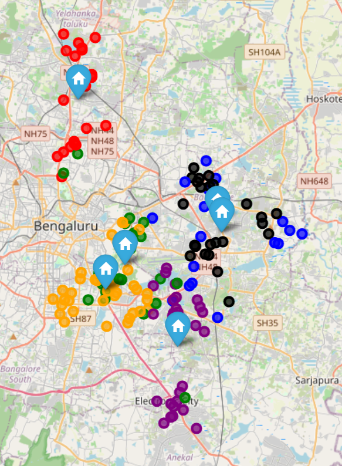
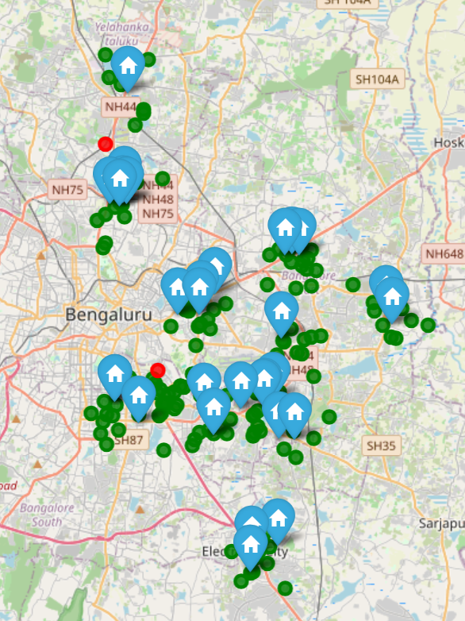
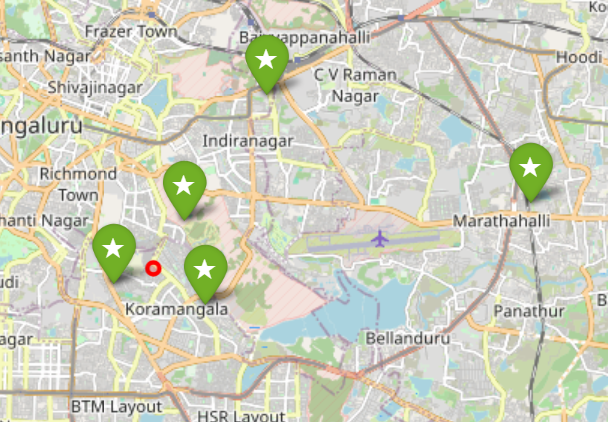

# Quick Commerce Dark Store Network Optimization

A geospatial analytics and network optimization project that identifies optimal locations for new dark stores in Bangalore using demand modeling, coverage analysis, clustering, and site selection frameworks.

---

## Business Problem

Quick-commerce companies rely on strategically located dark stores to fulfill customer orders within tight delivery windows.

This project addresses the following business question:

> Where should a quick-commerce company open new dark stores to maximize demand coverage, reduce service gaps, and strengthen market presence?

The analysis simulates an expansion strategy for a Bangalore-based dark-store network using demand, competition, and accessibility factors.

---

## Objectives

- Identify high-demand customer zones
- Evaluate existing network coverage
- Detect underserved markets
- Rank candidate expansion locations
- Recommend optimal dark-store placements

---

## Dataset Overview

### Demand Points
Represents customer demand across Bangalore.

**Features**
- Area
- Latitude
- Longitude
- Population
- Income Index
- Commercial Activity Index

### Existing Dark Stores
Current operational network locations.

### Competitor Locations
Simulated locations of competing quick-commerce providers.

### Candidate Sites
Potential locations for future expansion.

---

## Methodology

### 1. Demand Modeling

Created a weighted demand score using:

- Population Density
- Income Index
- Commercial Activity

Demand Score Formula:

Demand Score =

0.50 × Population +
0.30 × Income +
0.20 × Commercial Activity

---

### 2. Geospatial Demand Analysis

- Generated demand heatmaps
- Identified high-potential demand pockets
- Ranked areas by average demand score

---

### 3. Customer Clustering

Applied K-Means clustering to:

- Segment demand locations
- Identify service zones
- Understand geographic demand distribution

Features used:

- Latitude
- Longitude
- Demand Score

---

### 4. Network Coverage Analysis

Measured:

- Distance to nearest dark store
- Service coverage percentage
- Uncovered demand locations

Assumption:

- Service Radius = 3 km

---

### 5. Site Selection Framework

Candidate sites were evaluated using a weighted scoring model.

| Factor | Weight |
|----------|---------|
| Demand Potential | 35% |
| Population Potential | 25% |
| Competition Gap | 20% |
| Accessibility | 10% |
| Rent Proxy | 10% |

---

### 6. Network Expansion Optimization

Implemented a greedy optimization algorithm to:

- Select the most valuable expansion locations
- Maximize incremental demand coverage
- Prioritize high-impact sites

---

## Key Results

### Network Performance

| Metric | Value |
|----------|---------|
| Current Coverage | 98.67% |
| Expanded Coverage | 99.33% |
| Coverage Improvement | 0.66% |
| Average Distance to Store | 1.27 km |
| Uncovered Demand Points | 2 |

### Recommended Expansion Locations

| Rank | Area | Site Score |
|---------|---------|---------|
| 1 | Koramangala | 75.81 |
| 2 | Koramangala | 74.33 |
| 3 | Marathahalli | 70.68 |
| 4 | Koramangala | 69.33 |
| 5 | Indiranagar | 65.16 |

---

## Project Structure

```text
quick-commerce-dark-store-network-design/

├── data/
│   ├── raw/
│   └── processed/
│
├── src/
│   ├── data_preparation.py
│   ├── demand_analysis.py
│   ├── clustering.py
│   ├── coverage_analysis.py
│   ├── site_scoring.py
│   ├── optimization.py
│   └── executive_summary.py
│
├── maps/
├── reports/
├── screenshots/
│
├── generate_data.py
├── requirements.txt
├── README.md
└── .gitignore
```

---

## Sample Visualizations

### Demand Heatmap



### Customer Clusters



### Network Coverage



### Recommended Expansion Sites



---

## Technologies Used

- Python
- Pandas
- NumPy
- Scikit-Learn
- Geopy
- Folium
- Geospatial Analytics
- Network Optimization

---

## Business Impact

This project demonstrates how geospatial analytics and network optimization can support strategic expansion decisions in quick commerce by:

- Identifying demand hotspots
- Evaluating network efficiency
- Prioritizing high-value expansion opportunities
- Supporting data-driven operational planning

---

## Future Improvements

- Incorporate real Bangalore demographic data
- Use actual road-network travel times
- Integrate rental and real-estate datasets
- Apply facility location optimization models
- Build an interactive Power BI dashboard

---

## Author

Sanjesh

Data Analytics | Business Analytics | Geospatial Analytics | Consulting Projects